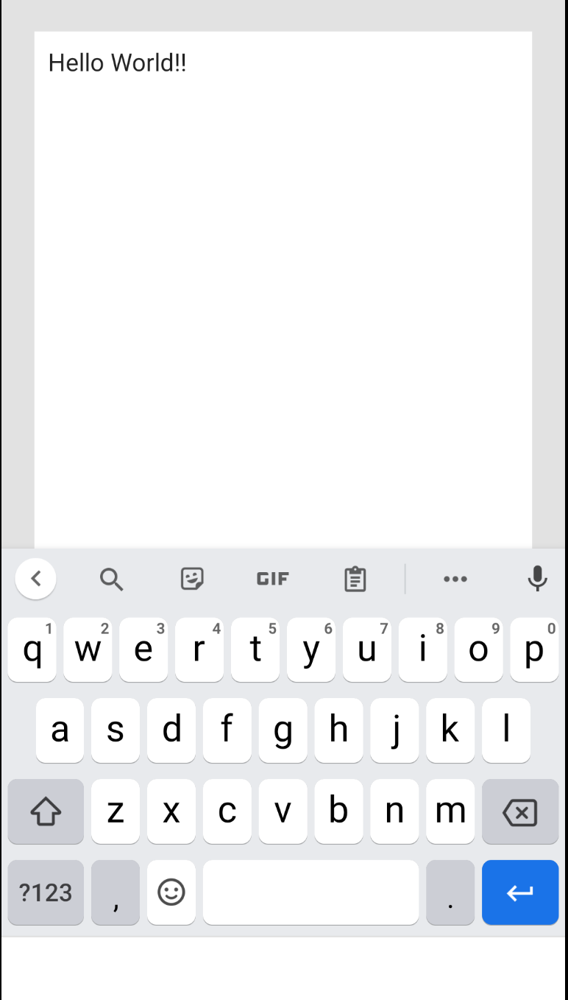

# 비밀 다이어리

# 결과화면

# 이 프로젝트를 통해 배우는 것

- **Layout** 을 그리는 법
  - **ConstraintLayout** 사용하기 (2)
  - Custom Font 사용하기
- **Handler** 사용하기
- **SharedPreference** 의 속성들과 사용하는 법
- **Theme** 사용하기
- **AlertDialog** 사용하기

### Kotlin 문법

android-ktx 로 SharedPreference 사용하기 (Kotlin Android Extension)

### 비밀 다이어리

다이어리 처럼 UI 꾸며보기

비밀번호를 저장하는 기능, 변경하는 기능

다이어리 내용을 앱이 종료되더라도 기기에 저장하는 기능